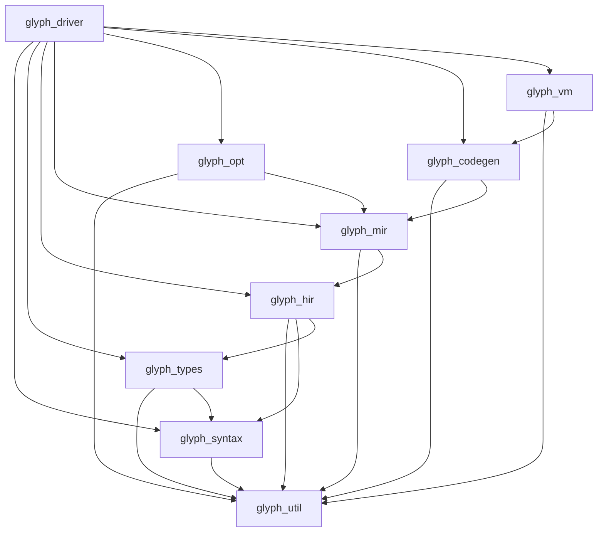

# Architecture

Glyph is a multi-pass compiler that turns a strict functional language into
register-based bytecode and runs it on a small VM with a copying GC. Every
stage is a real IR transformation you can dump and step through, no black-box
“backend.”

This document walks the pipeline end-to-end: what each package owns, what
flows between passes, and why the seams look the way they do.

Companion diagrams: [diagrams/pipeline.md](diagrams/pipeline.md),
[diagrams/types.md](diagrams/types.md), [diagrams/ssa.md](diagrams/ssa.md),
[diagrams/gc.md](diagrams/gc.md).

## Pipeline at a glance


CLI entry points (`glyph run`, `compile`, `typecheck`, `dump-mir`, `disasm`)
all share `glyph_driver`’s orchestration; they just stop at different stages
or feed different sinks.

## Package map

| Library | Path | Responsibility |
|---------|------|----------------|
| `glyph_util` | `lib/util` | Spans, diagnostics, idents, union-find, graphs, bitvecs, worklists |
| `glyph_syntax` | `lib/syntax` | Tokens, lexer, AST, Pratt/RD parser, pretty-printer |
| `glyph_types` | `lib/types` | Type AST, env, unification, Algorithm W, error formatting |
| `glyph_hir` | `lib/hir` | High-level IR, desugaring, pattern → decision trees |
| `glyph_mir` | `lib/mir` | CFG MIR, dominators, Cytron SSA, HIR lowering |
| `glyph_opt` | `lib/opt` | Pass manager + const/copy/SCCP/DCE/CSE/inline/simplify |
| `glyph_codegen` | `lib/codegen` | Opcode ISA, chunks, emit, disassembler |
| `glyph_vm` | `lib/vm` | Values, heap, Cheney GC, builtins, interpreter |
| `glyph_driver` | `lib/driver` | Wire the stages; CLI-facing compile API |

Dependency direction is strictly forward:



Nothing lower-level reaches back into the AST. That keeps dumps honest and
makes it safe to unit-test a pass with hand-built IR.

## Stage by stage

### 1. Lexing (`glyph_syntax.Lexer`)

Source text → stream of `(token * Span.t)`.

- Hand-written scanner (no `ocamllex`) so spans and error recovery stay under
  our control.
- Comments (`(* ... *)`), string escapes, int/float literals, keywords,
  operators, identifiers.
- Identifiers are interned via `glyph_util.Ident` / `Intern` so later stages
  compare stamps, not strings.

**Out:** token stream. **Errors:** unexpected char, unclosed string/comment,
emitted through `Diagnostic.Bag`.

### 2. Parsing (`glyph_syntax.Parser`)

Token stream → surface AST.

- Recursive descent for statements/items; Pratt parsing for expressions so
  operator precedence isn’t a nest of mutually recursive helpers.
- Items: `type` ADTs, `let` / `let rec` bindings, optional `extern` decls.
- Expressions: literals, apps, lambdas, `if`, `match`, tuples, constructors,
  binary/unary ops, blocks.
- Patterns: wild, var, lit, constructor, tuple, or-patterns, as-patterns.

**Out:** `Ast.program`. **Errors:** unexpected token with span + hints
(“expected `then` after `if` condition”).

### 3. Type inference (`glyph_types`)

AST → typed/elaborated program + type environment.

Classic Hindley–Milner (Algorithm W) with:

- unification + occurs check
- generalization *levels* (efficient let-polymorphism)
- ADT constructors in a type-constructor env
- recursive `let rec` (monomorphic binding during checking, then generalize)

See [type-system.md](type-system.md) for the math and worked examples.
Diagram: [diagrams/types.md](diagrams/types.md).

**Out:** schemes for top-level bindings, annotated expressions (or a type map
keyed by span/ident), diagnostics for mismatches.

**Design note:** Inference runs *before* desugaring. Patterns and sugar still
look like the surface language, so type errors point at source the user wrote.
Desugaring after typing means HIR can carry types without re-inferring.

### 4. Desugar → HIR (`glyph_hir`)

Typed AST → high-level tree IR.

HIR is still expression-oriented (ANF-ish: complex subexprs get names), but
already “compiler-shaped”:

- `&&` / `||` become nested `if`
- nested `let` flattened into sequences of bindings
- constructors/tuples explicit
- every node carries a type

Pattern matching is *not* left as `match` forever, the pattern compiler
turns clauses into decision trees / nested switches (Maranget-style
constructor specialization). That is the heaviest HIR pass; it must produce
exhaustive trees and bind scrutinee projections once.

**Out:** `Hir.program` of functions and top-level values.

### 5. Lower → MIR + SSA (`glyph_mir`)

HIR → control-flow graph of basic blocks, then SSA.

1. **Lower:** break expressions into statements; introduce temps; turn
   `if`/decision trees into branches and joins; calls, returns, ADT allocs
   become MIR ops.
2. **CFG:** preds/succs, reverse postorder, entry/exit.
3. **Dominators:** iterative or Lengauer–Tarjan; compute dominance frontiers.
4. **SSA (Cytron):** place `φ` at frontiers; rename to give each definition a
   unique name.

See [ir.md](ir.md). Diagram: [diagrams/ssa.md](diagrams/ssa.md).

**Out:** SSA MIR ready for dataflow.

### 6. Optimizations (`glyph_opt`)

Pass manager runs configurable pipelines (`O1` / `O2`):

| Pass | Idea |
|------|------|
| Const prop | Fold ops with known constants |
| Copy prop | Replace uses of `x = y` with `y` |
| SCCP | Sparse conditional constant propagation (lattice + CFG edges) |
| DCE | Drop unused defs / unreachable blocks |
| CSE / GVN | Kill redundant pure computations |
| Inline | Size-heuristic inliner for small callees |
| Simplify | Algebraic identities (`x+0`, `x*1`, …) |

Each pass is documented with before/after IR in [optimizations.md](optimizations.md).

**Invariant:** passes preserve SSA form (or re-SSA / cleanup as needed). φ
nodes are first-class; emitters later turn them into predecessor moves.

### 7. Codegen (`glyph_codegen`)

SSA MIR → bytecode chunk.

- Assign locals/registers to SSA names (or stack slots).
- Resolve block labels to jump offsets.
- Emit φ as copies on predecessor edges (classic SSA destruction lite).
- Pack code array + constant pool + function metadata (name, arity, local
  count).

ISA details: [vm.md](vm.md).

### 8. VM (`glyph_vm`)

Interpret bytecode.

- Stack of call frames (return IP, registers/locals, closure env).
- Heap for tuples, ADTs, closures, strings.
- Semi-space copying GC (Cheney): fromspace/tospace, forwarding pointers,
  roots from frames + globals.
- Builtins (`print_int`, `print_string`, …) as native callouts.

Diagram: [diagrams/gc.md](diagrams/gc.md).

## Data flowing between stages

| Boundary | Payload | Notes |
|----------|---------|-------|
| Source → Lexer | `string` + filename | Spans track file/line/col/offset |
| Lexer → Parser | token stream | Interned idents |
| Parser → Infer | `Ast.program` | Untyped surface |
| Infer → Desugar | typed AST + env | Schemes for polymorphic lets |
| Desugar/Pattern → Lower | `Hir.expr` / functions | Types on nodes; matches already trees |
| Lower → SSA | non-SSA MIR CFG | Temps may be assigned multiple times |
| SSA → Opt | SSA MIR | Unique defs; φ at joins |
| Opt → Emit | SSA MIR | Same shape, fewer ops |
| Emit → VM | `Chunk.t` | Code + consts + fun meta |
| VM runtime | `Value.t` on stack/heap | Tagged; GC moves heap objects |

Diagnostics (`Diagnostic.t`) can accumulate in a bag through early stages;
the driver stops the pipeline on errors before lowering.

## Design rationale

**Why hand-written lex/parse?** Spans and recovery matter more than grammar
sugar for a language this size. Pratt keeps expression precedence readable
without Menhir’s grammar file (we can add Menhir later if the surface grows).

**Why HM before HIR?** Source-shaped errors. Also, polymorphic lets need
generalization at binder sites that still look like `let`, after ANF and
pattern compilation the binder structure is messier.

**Why HIR then MIR?** Pattern decision trees and desugaring want a tree.
Dataflow and SSA want a CFG. Two IRs beat one “do everything” IR.

**Why SSA?** Const/copy/SCCP/DCE/CSE become textbook algorithms. φ placement
cost is paid once; opts get clean use-def chains.

**Why register bytecode + copying GC?** Simpler than a stack machine for
SSA lowering, and Cheney’s collector is the smallest GC that still teaches
moving collectors (forwarding pointers, tospace scan) without write barriers.

**Why OCaml?** Native algebraic types for ASTs/IRs, excellent pattern
matching for compilers, and a culture that already thinks in Hindley–Milner.

## Invariants worth caring about

- Every syntax node carries a `Span.t` so diagnostics can point at source.
- Type inference never fabricates spans; it reuses AST spans.
- SSA form is maintained or deliberately destroyed inside a pass, never
  left half-broken for the next one.
- The GC must treat forwarding pointers as the single source of truth while
  a collection is in flight.

## Driver orchestration (conceptual)

```text
compile file =
  source  <- read file
  tokens  <- lex source
  ast     <- parse tokens
  typed   <- infer ast          -- stop if errors
  hir     <- desugar + patterns typed
  mir     <- lower hir |> ssa
  mir'    <- opt_pipeline mir
  chunk   <- emit mir'
  chunk
```

`run` = compile then `Interp.exec chunk`.  
`typecheck` stops after infer.  
`dump-mir` stops after SSA (or after opts with a flag).  
`disasm` loads a `.gbc` and prints opcodes.

## Related docs

- [language.md](language.md), surface language
- [type-system.md](type-system.md), inference details
- [ir.md](ir.md), HIR/MIR/SSA
- [vm.md](vm.md), ISA and GC
- [optimizations.md](optimizations.md), each opt pass
- [contributing.md](contributing.md), build, test, add a pass
