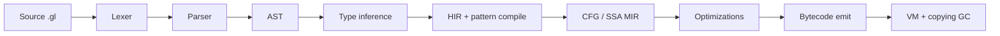

# Architecture

Glyph is a multi-pass compiler and bytecode virtual machine for a small strict
functional language. Everything from the lexer to the garbage collector lives
in this repository and is written in OCaml.

## Pipeline

Each arrow is a pure transformation (plus diagnostic accumulation). The driver
in `lib/driver` wires the stages and decides whether to stop after typing,
dump IR, emit a `.gbc` chunk, or run immediately.

## Layers

### Syntax

Hand-written lexer and recursive-descent parser with Pratt parsing for
operators. Keeping the front-end manual makes spans, error messages, and
operator tables easy to evolve without fighting a grammar generator.

### Types

Classic Hindley–Milner (Algorithm W) with Rémy-style levels for
let-generalization. Unification is destructive with path compression; type
constructors and data constructors live in a structured environment seeded
with the prelude.

### HIR and patterns

The high-level IR is a desugared lambda calculus. Nested `match` expressions
are compiled to decision trees so later stages only see simple switches and
projections — closer to what the VM can execute.

### MIR and SSA

Functions are lowered to a control-flow graph. We compute dominators and
dominance frontiers, insert φ-nodes, and rename into SSA form. Optimizations
then become local rewrites on a sparse IR.

### Optimizations

The pass manager runs a pipeline roughly like:

1. CFG simplify
2. SCCP (sparse conditional constant propagation)
3. Copy propagation
4. CSE / local value numbering
5. Dead code elimination
6. Inlining
7. CFG simplify again

Passes share a small dataflow framework (`Dataflow`) so new analyses stay
short.

### Codegen

SSA values are assigned VM registers (linear scan when density warrants it,
otherwise a straightforward slot map). The emitter produces a `Chunk`: code,
constant pool, and function prototypes.

### VM

A register-ish bytecode interpreter with stack frames. Heap objects (tuples,
ADT cells, closures, strings) live in a semi-space heap; allocation failure
triggers a Cheney-style copying collection rooted at the stack and globals.

## Invariants worth caring about

- Every syntax node carries a `Span.t` so diagnostics can point at source.
- Type inference never fabricates spans; it reuses AST spans.
- SSA form is maintained or deliberately destroyed inside a pass — never
  left half-broken for the next one.
- The GC must treat forwarding pointers as the single source of truth while
  a collection is in flight.

## Diagram index

- [Compiler pipeline](diagrams/pipeline.md)
- [Type inference](diagrams/types.md)
- [SSA construction](diagrams/ssa.md)
- [GC](diagrams/gc.md)
