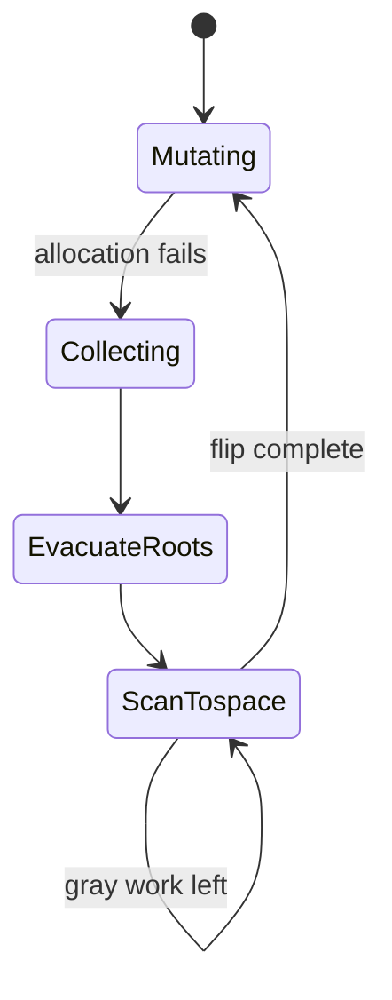
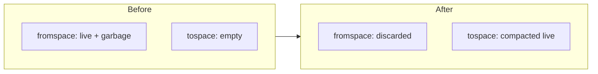
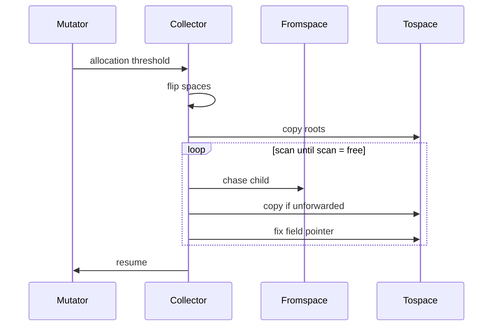

# Semi-space GC diagram

Fromspace holds the old heap; tospace is empty at flip. Roots are frames'
registers plus globals. Every evacuated object installs a forwarding pointer
so diamond-shaped references converge.

Prose: [../vm.md](../vm.md).
