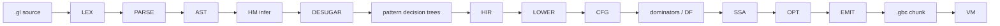

```mermaid
flowchart LR
  SRC[".gl source"] --> LEX
  LEX --> PARSE
  PARSE --> AST
  AST --> TYPE["HM infer"]
  TYPE --> DESUGAR
  DESUGAR --> PAT["pattern decision trees"]
  PAT --> HIR
  HIR --> LOWER
  LOWER --> CFG
  CFG --> DOM["dominators / DF"]
  DOM --> SSA
  SSA --> OPT
  OPT --> EMIT
  EMIT --> CHUNK[".gbc chunk"]
  CHUNK --> VM
```

The driver can stop after any dashed checkpoint (`--dump-ast`, `--dump-hir`,
`--dump-mir`, `--dump-bytecode`) which is how most of the test suite and
debugging sessions inspect intermediate state.
