# Pipeline diagrams

Embeddable Mermaid diagrams for Glyph docs and READMEs. No prose beyond short
captions.

## End-to-end compiler pipeline

```mermaid
flowchart LR
  SRC[".gl source"] --> LEX[Lexer]
  LEX --> PAR[Parser]
  PAR --> AST[Surface AST]
  AST --> HM[HM inference]
  HM --> TAST[Typed AST]
  TAST --> DES[Desugar]
  DES --> PAT[Pattern compile]
  PAT --> HIR[HIR]
  HIR --> LOW[Lower]
  LOW --> SSA[SSA]
  SSA --> OPT[Opts]
  OPT --> EMIT[Codegen]
  EMIT --> BC["Bytecode .gbc"]
  BC --> VM[VM + GC]
```

## Package dependencies

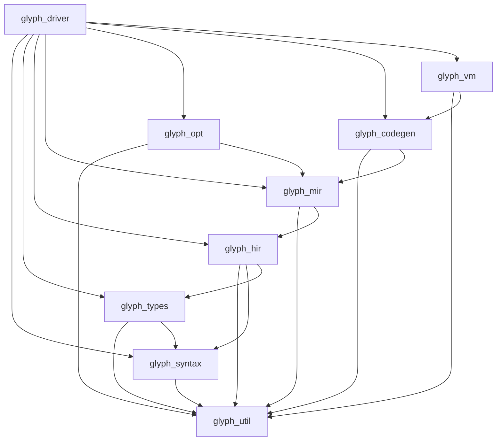

## Type inference flow

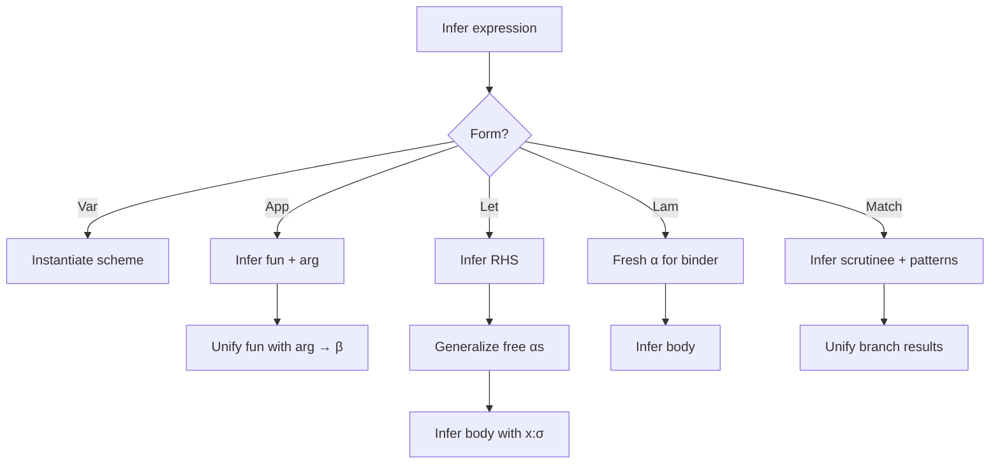

## Pattern matrix specialization

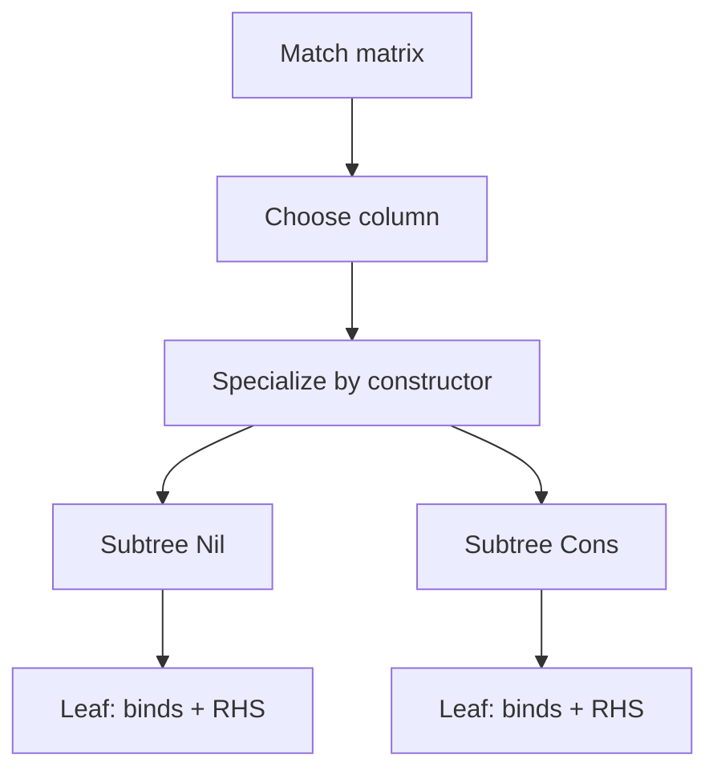

## SSA construction

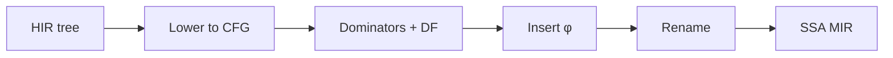

## Diamond CFG and φ

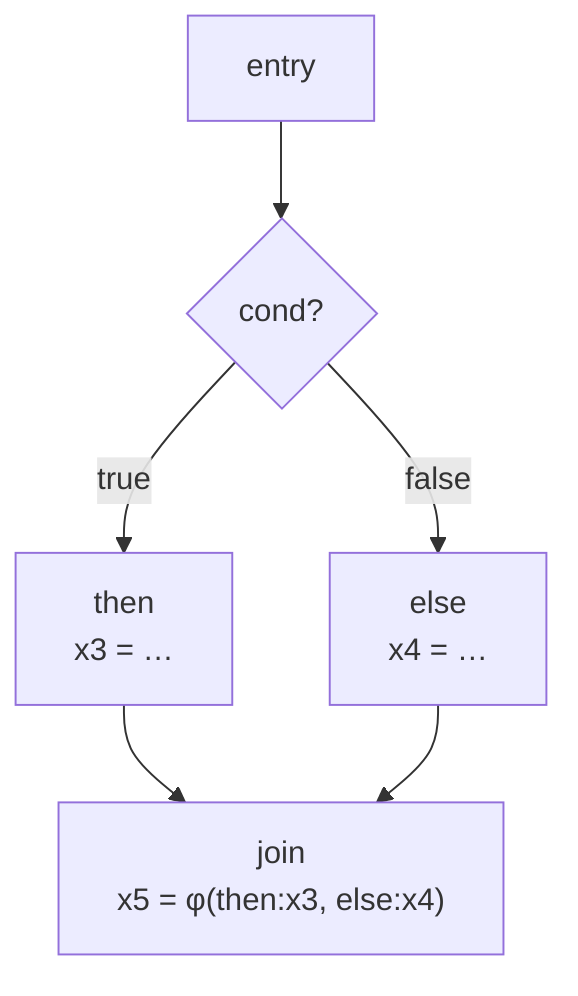

## Optimization pipeline

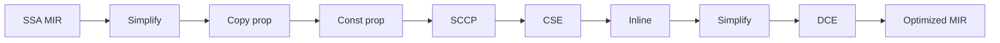

## SCCP executable edges

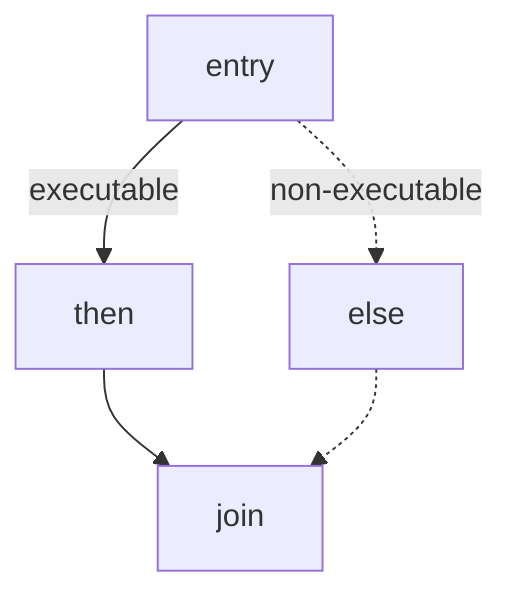

## Call frames and heap

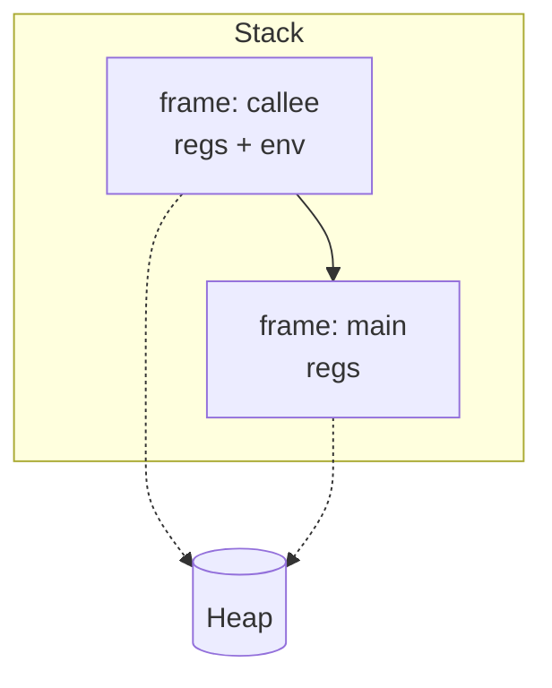

## Semi-space GC flip

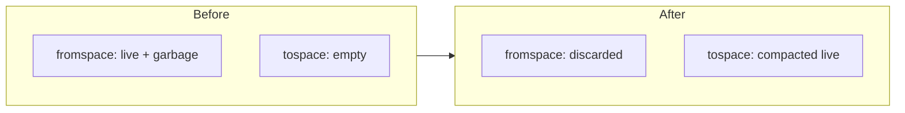

## Cheney collection sequence

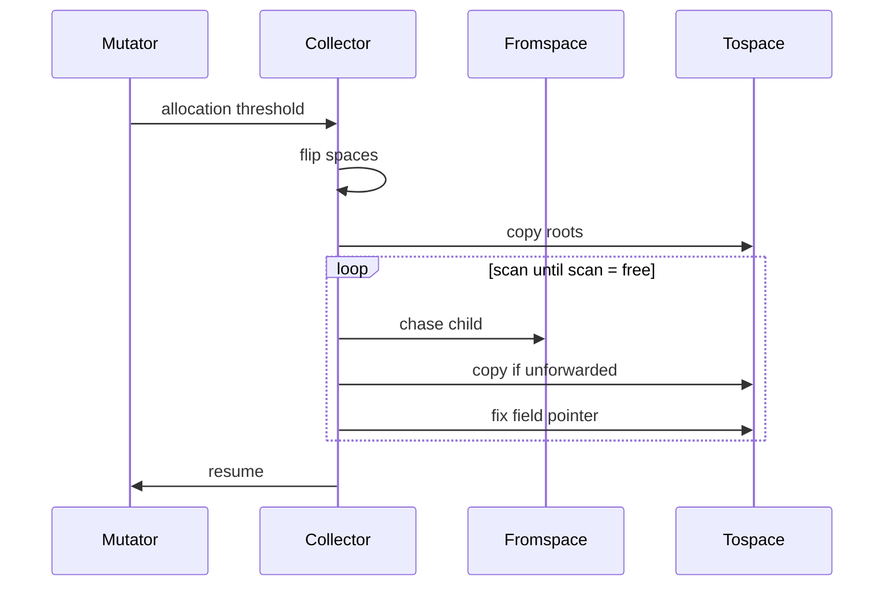

## CLI stage selection

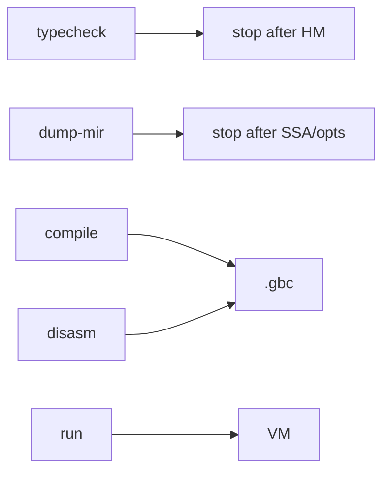
