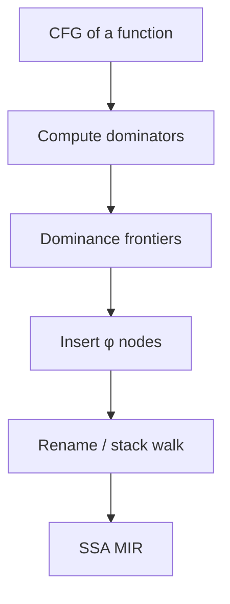

Implementation notes live in `lib/mir/dominators.ml` and `lib/mir/ssa.ml`.
The construction follows the Cytron et al. playbook: frontiers decide where
φs appear; the rename pass threads version stacks per variable.
