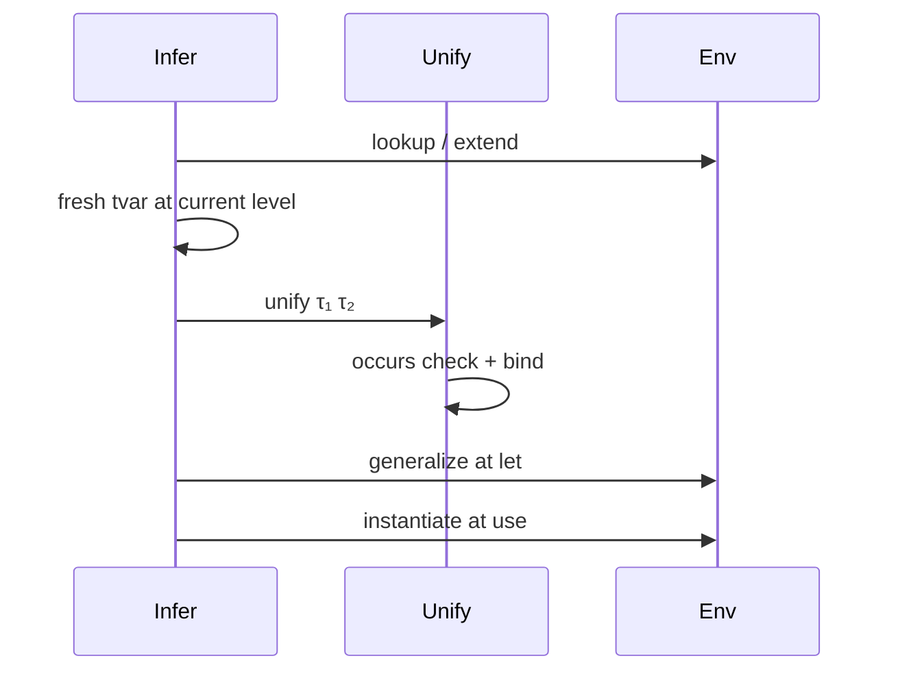
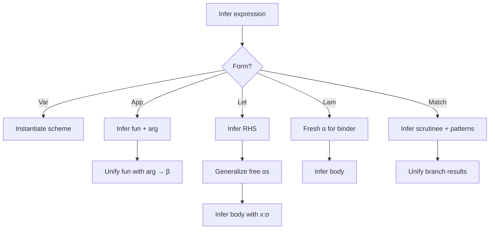

# Type inference diagram

```mermaid
sequenceDiagram
  participant Inf as Infer
  participant U as Unify
  participant Env as Env
  Inf->>Env: lookup / extend
  Inf->>Inf: fresh tvar at current level
  Inf->>U: unify τ₁ τ₂
  U->>U: occurs check + bind
  Inf->>Env: generalize at let
  Inf->>Env: instantiate at use
```

```mermaid
flowchart TD
  A[Infer expression] --> B{Form?}
  B -->|Var| I[Instantiate scheme]
  B -->|App| C[Infer fun + arg]
  C --> U[Unify fun with arg → β]
  B -->|Let| D[Infer RHS]
  D --> G[Generalize free αs]
  G --> E[Infer body with x:σ]
  B -->|Lam| F[Fresh α for binder]
  F --> H[Infer body]
  B -->|Match| M[Infer scrutinee + patterns]
  M --> BR[Unify branch results]
```

Prose: [../type-system.md](../type-system.md).
