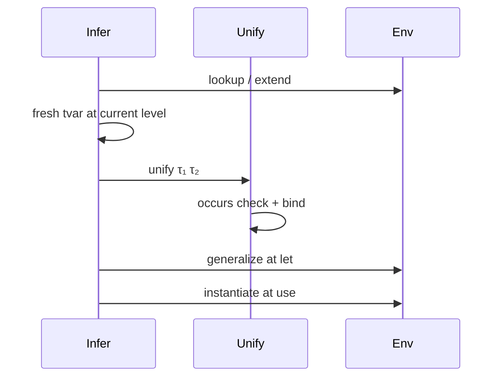

```mermaid
sequenceDiagram
  participant Inf as Infer
  participant U as Unify
  participant Env as Env
  Inf->>Env: lookup / extend
  Inf->>Inf: fresh tvar at current level
  Inf->>U: unify τ₁ τ₂
  U->>U: occurs check + bind
  Inf->>Env: generalize at let
  Inf->>Env: instantiate at use
```
