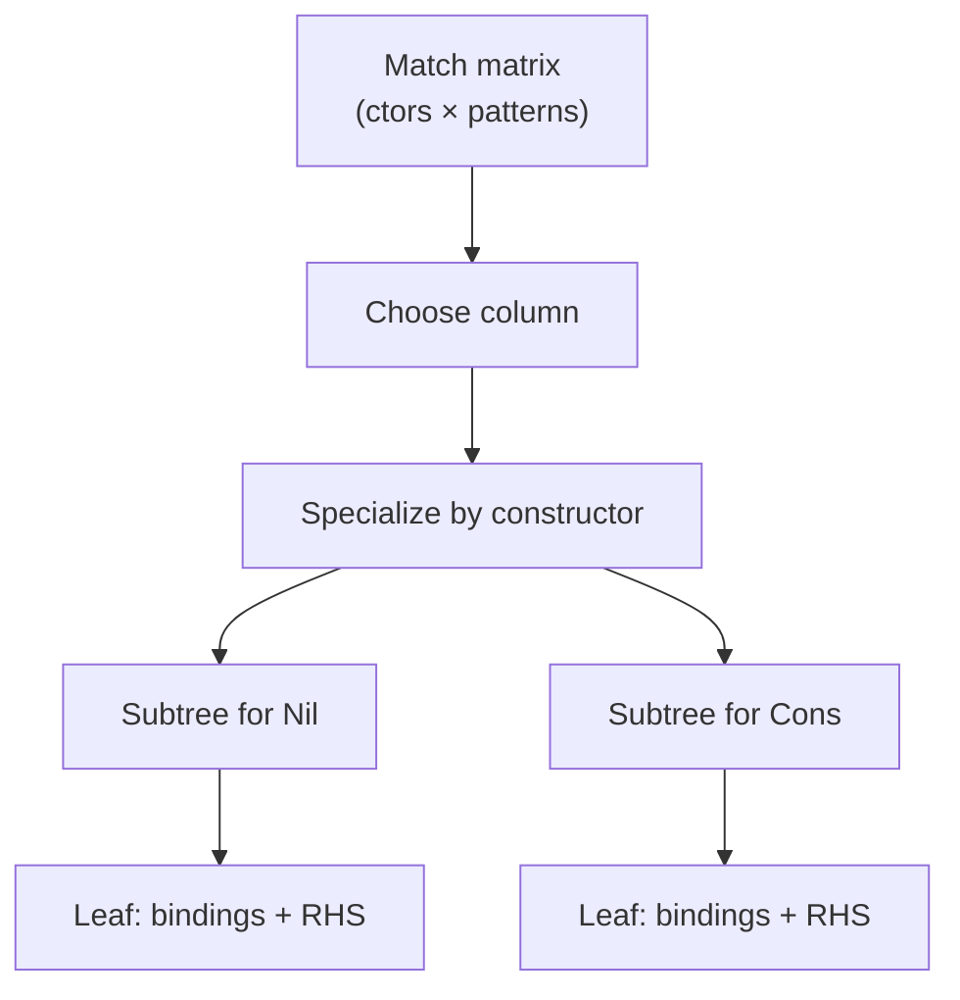
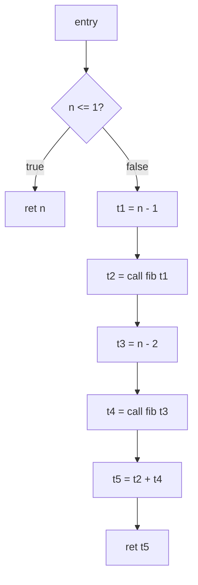
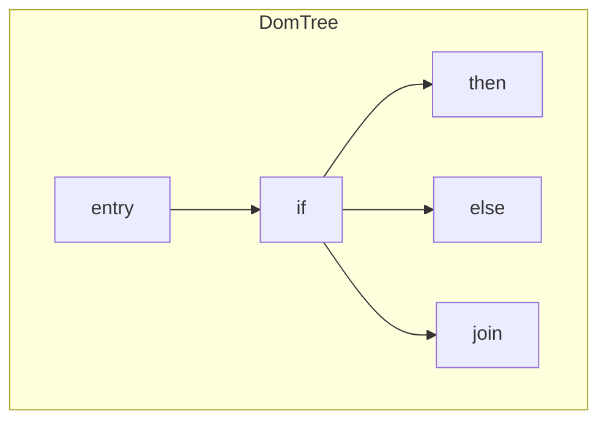

# Intermediate representations

Glyph uses two IRs after typing:

1. **HIR**, tree-shaped, typed, close to a desugared surface language;
   pattern matches become decision trees.
2. **MIR**, control-flow graph of basic blocks; then **SSA** form for
   optimization and codegen.

This note covers shapes, SSA construction (Cytron-style φ placement + rename),
and lowering examples. Pipeline context: [architecture.md](architecture.md).

## Why two IRs?

| Concern | HIR | MIR |
|---------|-----|-----|
| Patterns | Decision trees, nested switches | Already branches + projections |
| Binding | Nested `let` / ANF names | Locals across blocks |
| Control | Structured `if` / `switch` | CFG edges, joins |
| Opt | Light (maybe) | Dataflow / SSA passes |
| Codegen | Awkward | Natural → bytecode |

Desugar and match compilation want trees. Const prop and SCCP want graphs.
Fighting that with one IR usually ends in tears.

## HIR

### Shape (conceptual)

```text
program  ::= fun* top*
fun      ::= name params body
expr     ::= lit
           | var
           | let name = expr in expr
           | app expr expr*
           | if expr expr expr
           | switch expr (tag → binds → expr)* [default]
           | tuple expr*
           | adt tag expr*
           | proj expr index
           | prim op expr*
           | closure captures params body
```

Every node carries a **type** (from inference / elaboration). Names are
`Ident.t` (often gensym’d temps).

### Desugaring highlights (`desugar.ml`)

| Surface | HIR |
|---------|-----|
| `e1 && e2` | `if e1 then e2 else false` |
| `e1 \|\| e2` | `if e1 then true else e2` |
| nested `let` | flattened or ANF’d |
| `e1 |> e2` | `e2 e1` |
| lambda | `closure` / nested function |

ANF-ish discipline: non-trivial subexpressions get names so MIR lowering
doesn’t rediscover evaluation order.

### Pattern compilation (`pattern.ml`)

Input: typed `match` with constructor / literal / tuple / or / as patterns.  
Output: nested **decision tree**:

```text
switch scrutinee.tag
  | Nil  -> …
  | Cons ->
      let x    = proj scrut 0 in
      let rest = proj scrut 1 in
      …
```

Algorithm family: **Maranget** / constructor specialization, pick a column,
case-split on outermost constructors, specialize the matrix, recurse. Goals:

- Exhaustiveness (or explicit default / error case)
- Share projections (don’t re-match the same tag)
- Compile or-patterns by duplicating specialized rows



Leaves become HIR `let` bindings for pattern variables plus the clause RHS.

## MIR

### Values and instructions (conceptual)

```text
val  ::= const k | local v | global g

inst ::= v = bin op v₁ v₂
       | v = unary op v₁
       | v = call f v*
       | v = alloc_tuple v*
       | v = alloc_adt tag v*
       | v = alloc_closure f captures*
       | v = field vᵢ idx
       | v = get_tag v
       | v = φ (pred₁:v₁, pred₂:v₂, …)     (* SSA only *)
       | store …                            (* if any *)

term ::= goto L
       | branch v Ltrue Lfalse
       | switch v (tag → L)* default L
       | ret v
```

### Basic blocks and CFG

```text
block = label: inst* terminator
fun   = name, params, entry, blocks
```

`cfg.ml` builds predecessor/successor sets, reverse postorder (RPO), and
identifies the entry. Critical for dominators and SCCP’s executable-edge
lattice.



## Dominators and dominance frontiers

Block **A dominates B** if every path from entry to B goes through A.  
**Immediate dominator** `idom(B)` is the closest strict dominator.

**Dominance frontier** `DF(B)`: blocks where `B`’s dominance “stops”,
join points that need φ for variables assigned in `B`.

```text
DF(B) = { C | B dominates a predecessor of C,
             but B does not strictly dominate C }
```

Computed after the dominator tree (iterative dataflow or Lengauer–Tarjan).



For a diamond CFG, `DF(then)` and `DF(else)` both contain `join`, so
assignments in either arm get a φ at `join`.

## SSA construction (Cytron et al.)

### Phase 1, Insert φ

For each variable `x` that is assigned in several blocks:

1. Let `W` be the set of blocks that define `x`.
2. Iteratively add φ in blocks in `DF(W)`, and treat those as new defs.

```text
while W nonempty:
  B <- pop W
  for C in DF(B):
    if no φ for x in C:
      insert x = φ(...)
      if C not already a def site: push C onto W
```

### Phase 2, Rename

DFS over the dominator tree with a per-variable stack of current names:

- On def of `x`, push fresh `x₃`, rewrite def.
- Rewrite uses to stack top.
- Fill φ operands from predecessor stacks when walking edges.
- Pop on exit from block.

Result: each name defined exactly once; uses dominated by that def.

### Reading φ

```text
join:
  x5 = φ (then: x3, else: x4)
  …
```

Meaning: if control arrived from `then`, `x5` is `x3`; from `else`, `x4`.
At codegen, emit `mov` into a shared slot on each predecessor edge (SSA
destruction), or keep virtual regs and let the emitter assign locals.

## Lowering examples

### If-expression

**Source / HIR**

```glyph
if n <= 1 then n else n - 1
```

**Non-SSA MIR (sketch)**

```text
entry:
  c = bin Le n 1
  branch c then else
then:
  r = n
  goto join
else:
  r = bin Sub n 1
  goto join
join:
  ret r
```

**SSA MIR**

```text
entry:
  c = bin Le n0 1
  branch c then else
then:
  goto join
else:
  t1 = bin Sub n0 1
  goto join
join:
  r2 = φ (then: n0, else: t1)
  ret r2
```

### Match on list

**HIR decision tree**

```text
switch tag(xs)
| Nil  -> 0
| Cons ->
    let x = field xs 0 in
    let r = field xs 1 in
    1 + length r
```

**MIR sketch**

```text
entry:
  t = get_tag xs0
  switch t
    Nil  -> b_nil
    Cons -> b_cons
b_nil:
  ret 0
b_cons:
  x1  = field xs0 0
  r1  = field xs0 1
  n1  = call length r1
  n2  = bin Add 1 n1
  ret n2
```

(Recursive `length` is a call; after inlining opts may specialize.)

### Closure

**HIR**

```text
closure {n} (x) => bin Add n x
```

**MIR**

```text
c1 = alloc_closure make_adder_inner n0
```

Runtime: heap object with function id + captured values. See [vm.md](vm.md).

## From SSA MIR to bytecode

`glyph_codegen.Emit`:

1. Schedule blocks (RPO or layout that favors fall-through).
2. Map SSA names → local slots / virtual registers.
3. For each φ at block `B`, on each predecessor edge emit moves into the
   destination slot **before** the jump.
4. Emit ops (`ADD`, `CALL`, `ALLOC_ADT`, …) and patch jump offsets.

φ nodes never appear in the bytecode ISA, they’re compile-time fiction that
make opts nice.

## Module map

| File | Role |
|------|------|
| `hir.ml` | HIR AST |
| `desugar.ml` | AST → HIR |
| `pattern.ml` | Match → decision tree |
| `mir.ml` | MIR AST (insts, blocks, φ) |
| `cfg.ml` | Preds/succs, RPO |
| `dominators.ml` | Dom tree + DF |
| `ssa.ml` | φ insert + rename |
| `lower.ml` | HIR → MIR → SSA |

## Related

- [optimizations.md](optimizations.md), passes on SSA MIR
- [vm.md](vm.md), what emit targets
- [diagrams/pipeline.md](diagrams/pipeline.md), overview diagrams
