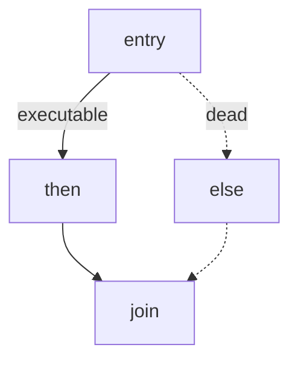

# Optimization passes

All passes run on **SSA MIR** (`glyph_opt`). The pass manager (`pass.ml` /
`pipeline.ml`) sequences them for `O0` (none), `O1` (cheap), and `O2`
(aggressive). Each pass preserves (or restores) SSA form and CFG validity.

Companion IR shapes: [ir.md](ir.md).

## Pipeline defaults

```text
O1: simplify → copy_prop → const_prop → dce
O2: O1 + sccp → cse → inline → simplify → copy_prop → const_prop → dce
```

Iterating simplify/copy/const/dce a couple of times is fine, each pass is
idempotent enough that a fixed iteration count works.


## Pass interface

Conceptually:

```text
module type PASS = sig
  val name : string
  val run : Mir.func -> Mir.func   (* or whole program *)
end
```

Passes may also return stats (deleted instructions, inlined calls) for
`-dump-opt-stats` style debugging later.

---

## Algebraic simplify

**Goal:** Local rewrites that don’t need heavy dataflow.

| Pattern | Result |
|---------|--------|
| `x + 0`, `0 + x` | `x` |
| `x * 1`, `1 * x` | `x` |
| `x * 0` | `0` (pure ints, no side effects) |
| `x - 0` | `x` |
| `x / 1` | `x` |
| `&& true`, `\|\| false` | other side |
| `not (not x)` | `x` |
| branch on constant | goto one successor |

**Before**

```text
t1 = bin Add x0 0
t2 = bin Mul t1 1
ret t2
```

**After**

```text
ret x0
```

---

## Copy propagation

**Goal:** If `x = y` (pure move / φ-less copy), replace uses of `x` with `y`
and delete the copy when dead.

**Before**

```text
b0:
  a1 = bin Add x0 1
  b2 = a1          (* copy *)
  c3 = bin Mul b2 2
  ret c3
```

**After**

```text
b0:
  a1 = bin Add x0 1
  c3 = bin Mul a1 2
  ret c3
```

In SSA, copies often appear after φ-lowering prep or from desugaring. Walking
use-def chains makes this a linear pass.

---

## Constant propagation

**Goal:** Fold operations whose operands are constants; replace uses.

**Before**

```text
t1 = const 2
t2 = const 3
t3 = bin Add t1 t2
t4 = bin Mul t3 4
ret t4
```

**After**

```text
t4 = const 20
ret t4
```

Only **pure** ops fold. Calls, allocations, and prints stay.

---

## SCCP, sparse conditional constant propagation

**Goal:** Simultaneously discover constants **and** unreachable CFG edges
(Wegman–Zadeck). More powerful than separate const-prop + unreachable-block
elimination.

### Lattice

```text
⊤  (unknown / not yet)
C(k)  (constant k)
⊥  (varying / non-constant)
```

Meet: same constants meet to that constant; conflicting → `⊥`.

### Worklists

1. **SSA edges** (def → use): when a value’s lattice cell drops, re-visit uses.
2. **Flow edges:** only propagate into blocks reachable via executable edges.
   A `branch` on `C(true)` marks only the true successor executable.

**Before**

```text
entry:
  c1 = const true
  branch c1 b_then b_else
b_then:
  x2 = const 1
  goto join
b_else:
  x3 = const 2
  goto join
join:
  x4 = φ (b_then: x2, b_else: x3)
  ret x4
```

**After SCCP**

```text
entry:
  goto b_then
b_then:
  ret 1
```

(`b_else` and φ disappear once the edge is dead and DCE cleans up.)



---

## Dead code elimination

**Goal:** Remove instructions whose results are unused, and blocks that are
unreachable from entry.

Mark-and-sweep on SSA:

1. Seed roots: terminators, effectful ops (`call` to impure, `ret`, stores,
   prints).
2. Walk use-def backwards; mark needed defs.
3. Delete unmarked insts; drop unreachable blocks; repair φ operands.

**Before**

```text
t1 = bin Add x0 1
t2 = bin Mul x0 2      (* unused *)
ret t1
```

**After**

```text
t1 = bin Add x0 1
ret t1
```

DCE after SCCP is where whole arms of `if` vanish.

---

## CSE / local value numbering

**Goal:** Don’t recompute the same pure expression.

**Before**

```text
t1 = bin Add a0 b0
t2 = bin Mul t1 3
t3 = bin Add a0 b0     (* same as t1 *)
t4 = bin Sub t2 t3
ret t4
```

**After**

```text
t1 = bin Add a0 b0
t2 = bin Mul t1 3
t4 = bin Sub t2 t1
ret t4
```

Global value numbering (hashing expr + operands’ VN) across a dominator tree
catches more cases; a block-local table is the minimum viable CSE.

**Congruence conditions:** same opcode, equivalent operands, pure, no
intervening side effect that could matter (for Glyph’s MIR, allocations are
not CSE’d, identity matters).

---

## Inlining

**Goal:** Replace a call with the callee body when profitable.

Heuristics (typical):

- Callee instruction count ≤ threshold (e.g. 20–40 insts)
- Not recursive (or only leaf self-recursion unrolled carefully, start by
  refusing recursive callees)
- Single-call-site bonus
- Don’t inline functions that allocate huge literals / have many calls

**Before**

```text
fun add1(x):
  t = bin Add x 1
  ret t

fun main():
  a = const 41
  b = call add1 a
  ret b
```

**After**

```text
fun main():
  a = const 41
  t = bin Add a 1
  ret t
```

Implementation sketch: clone callee blocks into caller, rename SSA values,
map parameters to argument names, redirect `ret` to a join continuation with
φ if multiple returns. Then run copy/const/dce to tidy.

---

## Pass interactions (example)

Starting IR for `if true then 1 + 0 else f x`:

```text
entry:
  c = const true
  branch c t e
t:
  a = bin Add 1 0
  goto j
e:
  b = call f x0
  goto j
j:
  r = φ (t: a, e: b)
  ret r
```

1. **Simplify / const:** `1+0` → `1`.
2. **SCCP:** only `t` executable; `r` ≡ `1`.
3. **DCE:** delete `e`, φ, call.

Final:

```text
entry:
  ret 1
```

That’s the whole point of stacking classic passes on SSA.

## Debugging opts

Useful driver flags (as they land):

```bash
dune exec glyph -- dump-mir examples/fib.gl
dune exec glyph -- dump-mir --opt O2 examples/fib.gl
```

Diff the MIR before/after a single pass when developing, the pass manager
should allow `--pass=sccp` style isolation.

## Related

- [ir.md](ir.md), SSA / φ refresher
- [architecture.md](architecture.md), where opts sit in the pipeline
- [contributing.md](contributing.md), how to add a new pass
