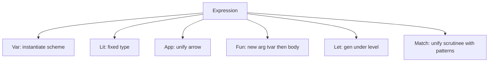

# Type system

Glyph uses Hindley–Milner type inference with let-polymorphism.

## Algorithm W (as implemented)



Key pieces:

- **Unification** with occurs-check and destructive binding
- **Levels** so generalization only quantifies variables that did not escape
- **Schemes** `∀α₁…αₙ. τ` stored in the value environment
- **Data constructors** registered from `type` declarations with arity and
  result type constructor

## Examples

```glyph
let id x = x
(* id : ∀a. a -> a *)

let const x y = x
(* const : ∀a b. a -> b -> a *)

let head xs =
  match xs with
  | Cons x _ -> x
  | Nil -> fail "empty"
(* head : ∀a. List a -> a *)
```

## Records and tuples

Tuples are structural (`(Int, Bool)`). Records are nominal-enough for this
implementation: field sets must match exactly under unification, which keeps
the solver simple without row variables. A natural extension would add Rémy
rows; the MIR already treats field projection uniformly.

## Error reporting

Unification failures re-attach the nearest AST span and render through
`Diagnostic`, including a source caret when the driver still has the buffer.
