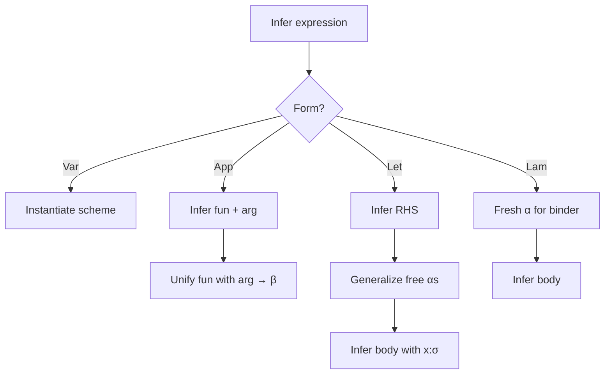

# Type system

Glyph uses classical **Hindley–Milner** type inference (Algorithm W) with
**let-polymorphism**, **unification**, an **occurs check**, and **levels** for
efficient generalization. This document is the design note for `glyph_types`:
what the representations mean, how the algorithms step, and worked examples
you can replay on paper.

Surface syntax for types and programs: [language.md](language.md).

## Type language

### Monotypes

```text
τ ::= α                     type variable
    | C                     nullary type constructor (Int, Bool, …)
    | τ τ₁ … τₙ             type application (List Int)
    | τ₁ → τ₂               function
    | (τ₁ * τ₂ * … * τₙ)    tuple (n ≥ 2); () is Unit
    | Unit | Int | Float | Bool | String
```

In the implementation (`ty.ml`), roughly:

| Constructor | Meaning |
|-------------|---------|
| `TVar` | Unification variable (ref cell + level + optional binding) |
| `TCon` | Named constructor |
| `TApp` | Application `List` `@` `[a]` |
| `TArrow` | Function |
| `TTuple` | Product |
| `TUnit`, `TInt`, … | Built-ins (or sugar over `TCon`) |

### Type schemes (polytypes)

```text
σ ::= ∀ α₁ … αₙ. τ
```

Only `let`-bound names get schemes. Lambda parameters stay monomorphic
(instantiated at use, never generalized mid-λ).

```ocaml
(* conceptual *)
type scheme = Forall of tv list * ty
```

### Environments

```text
Γ ⊢ e : τ
```

- **Value env:** `Ident → scheme`
- **Type env:** ADT definitions: name, parameters, constructors with arities
  and field types

Constructors (`Cons`, `None`) live in the value env as schemes.

## Algorithm W (sketch)

```text
infer(Γ, e) → (S, τ)
```

| Expression | Rule |
|------------|------|
| literal | Instantiated built-in type; `S = id` |
| variable `x` | Instantiate `Γ(x)` with fresh vars |
| `λx. e` | Fresh `α`; infer body under `Γ, x:α`; result `α → τ` |
| `e₁ e₂` | Infer both; unify `τ₁` with `τ₂ → β`; result `β` |
| `let x = e₁ in e₂` | Infer `e₁`; **generalize** free vars w.r.t. `Γ`; infer `e₂` under extended env |
| `if c then t else f` | `c : Bool`; unify branch types |
| `match` | Infer scrutinee; each pattern produces bindings + obligations; unify branch results |
| constructor app | Instantiate constructor scheme; unify argument types |

Substitutions compose; in practice we use **mutable unification variables**
instead of threading heavy substitutions (same idea as OCaml’s inferencer).



## Unification

Unification finds the most general unifier of two monotypes (or fails).

### Rules

```text
unify(α, τ)      = bind α ↦ τ   (after occurs check + level update)
unify(τ, α)      = unify(α, τ)
unify(C, C)      = ok
unify(τ₁→τ₂, υ₁→υ₂) = unify(τ₁,υ₁); unify(τ₂,υ₂)
unify(T a⃗, T b⃗) = pairwise unify
unify(τ, υ)      = fail otherwise
```

Follow the binding chain on variables (“zonk” / find) before comparing.

### Occurs check

Before binding `α ↦ τ`, ensure `α` does not occur in `τ`. Otherwise we would
build an infinite type:

```text
α = α → Int    ✗ occurs check fails
```

```glyph
(* This must be rejected: *)
let rec omega = fun x -> x x
(* Trying to unify α → β with α forces α = α → β *)
```

### Level updates

Each type variable carries a **level** (integer). Binding a variable into a
type that mentions deeper (higher-level) variables requires **lowering** levels
so generalization stays sound. See next section.

## Generalization and levels

### Classic generalization

```text
generalize(Γ, τ) = ∀ α⃗. τ
  where α⃗ = free(τ) \ free(Γ)
```

Instantiating replaces bound `α⃗` with fresh monotype variables.

### Why levels?

Naïvely computing `free(Γ)` every time is expensive. **Levels** (à la
OCaml / Rémy) make generalization O(size of τ):

- Global “current level” increases on entering a `let` RHS, decreases after.
- Fresh variables are born at the current level.
- Unification **updates** levels: if `α` at level `ℓ` is bound to a type
  containing `β` at level `ℓ' > ℓ`, lower `β` (and structure) to `ℓ`.
- Generalize: quantify variables still at the **current** (let) level;
  variables from outer scopes have lower levels and stay free/monomorphic.

```mermaid
sequenceDiagram
  participant Env as Γ (level 0)
  participant Let as let RHS (level 1)
  participant Body as let body (level 0)
  Env->>Let: enter let, level := 1
  Let->>Let: fresh α @ level 1
  Let->>Let: infer RHS : τ
  Let->>Body: generalize αs with level=1
  Body->>Body: level := 0; infer body
```

### Let-polymorphism example

```glyph
let id = fun x -> x in
(id 1, id true)
```

1. Enter RHS at level 1; `x : α₁`, body `α₁`, so `id`’s type is `α₁ → α₁`.
2. `α₁` is level 1 → generalize to `∀α. α → α`.
3. First use instantiates `α ↦ Int`; second `α ↦ Bool`. Independent.

### What does *not* generalize

```glyph
(fun id -> (id 1, id true)) (fun x -> x)
```

Here `id` is λ-bound → monomorphic → **type error** (cannot unify `Int` and
`Bool`). Same as ML.

## Recursive bindings

```glyph
let rec map f xs =
  match xs with
  | Nil -> Nil
  | Cons x r -> Cons (f x) (map f r)
```

Typical strategy:

1. Allocate a fresh monotype (or arrow skeleton) for `map` at the current level.
2. Check the RHS under `Γ, map : τ` (monomorphic).
3. Unify the inferred RHS type with `τ`.
4. Generalize after the recursive group is done.

`let rec … and …` shares the monomorphic env across the group, then
generalizes each binding.

## Patterns

Inferring `match e with p₁ -> e₁ | …`:

1. Infer `e : τₛ`.
2. For each clause, `infer_pat(pᵢ)` yields bindings `Γᵢ` and refines/unifies
   with `τₛ` (constructor patterns instantiate ADT schemes and peel fields).
3. Infer `eᵢ` under `Γ, Γᵢ`; unify all branch result types to `τᵣ`.
4. Result type `τᵣ`.

Or-patterns require identical binding sets and unified binder types.
As-patterns bind the scrutinee type to a name.

## Worked examples

### 1. Application and arrows

```glyph
let f = fun x -> fun y -> x in
f 1 true
```

| Step | Judgment / action |
|------|-------------------|
| `x` fresh `α` | |
| `y` fresh `β` | body type `α` |
| `f` | `α → β → α` → generalize `∀α β. α → β → α` |
| `f 1` | instantiate `α↦Int, β↦γ` → `Int → γ → Int`; arg `Int`; result `γ → Int` |
| `_ true` | unify `γ` with `Bool`; result `Int` |

### 2. Occurs check failure

```glyph
let boom = fun x -> x x
```

- `x : α`
- Self-application: need `α = α → β`
- Occurs check: `α` occurs in `α → β` → **error**

### 3. List map

```glyph
type List a = Nil | Cons a (List a)

let rec map f xs =
  match xs with
  | Nil -> Nil
  | Cons x rest -> Cons (f x) (map f rest)
```

Expected scheme:

```text
∀a b. (a → b) → List a → List b
```

Sketch:

- `map` provisional type `τₘ`.
- `f : α → β`, `xs : List α` (from constructor patterns).
- `Nil` branch: result `List γ`; unify `γ` with `β` via `Cons (f x) …`.
- `map f rest` uses `τₘ`; unify with `(α→β) → List α → List β`.
- Generalize `α, β`.

### 4. Level discipline (unsound without levels)

Imagine generalizing too eagerly inside:

```glyph
let f x =
  let g y = x in   (* if we wrongly generalize x's type variable here… *)
  g
```

`x`’s type variable must **not** be quantified when generalizing `g`, because
it escapes from the outer binder. Levels: `x`’s `α` has outer (lower) level,
so `generalize(g)` only picks variables introduced in `g`’s RHS.

## Error reporting

`glyph_types.Error` / diagnostics should:

- Show expected vs actual (zonked, pretty-printed)
- Point at the span of the failing expression or pattern
- Add notes for “occurs check”, “recursive type”, “missing field/ctor”

Example shape:

```text
examples/boom.gl:1:18-1:21: error: occurs check: cannot construct infinite type
  1 | let boom = fun x -> x x
    |                     ^^^
  note: type variable α occurs in α → β
```

## Implementation map

| Module | Role |
|--------|------|
| `Ty` | Type AST, schemes, levels, fresh, zonk, pp |
| `Env` | Value + type-constructor environments |
| `Unify` | Unification, occurs, level updates |
| `Infer` | Algorithm W over the AST |
| `Error` | Pretty type errors |

## References (ideas, not dependencies)

- Damas & Milner, *Principal type-schemes for functional programs*
- Algorithm W / J (standard textbook presentations)
- OCaml’s level-based generalization (efficient let-polymorphism)
- Peyton Jones et al. on practical type inference for HM
