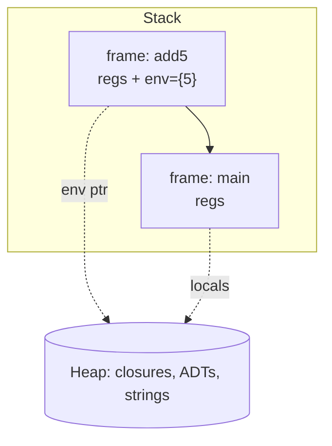
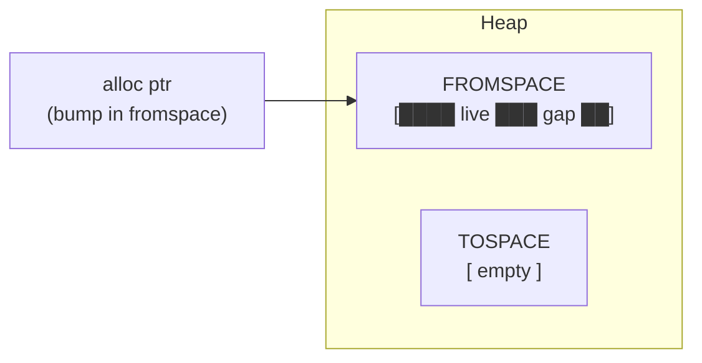
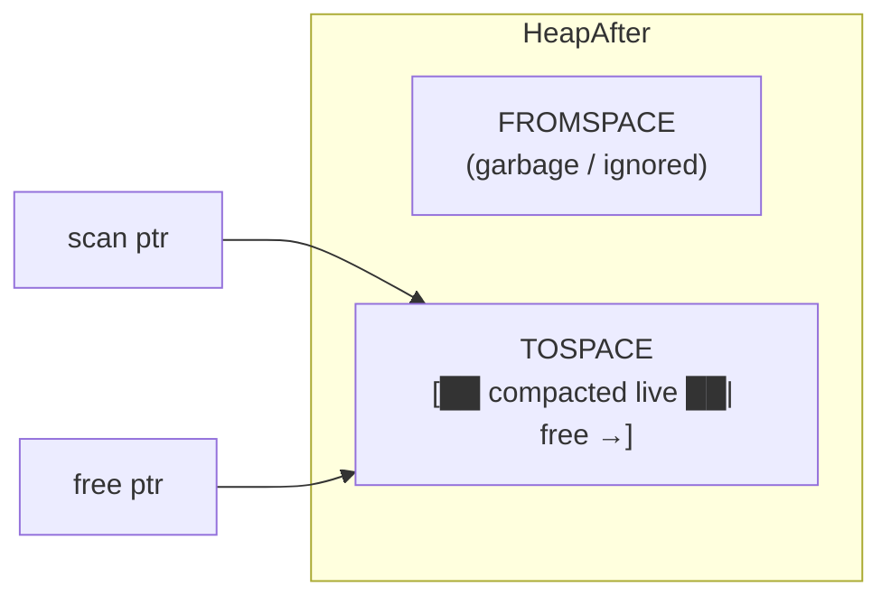
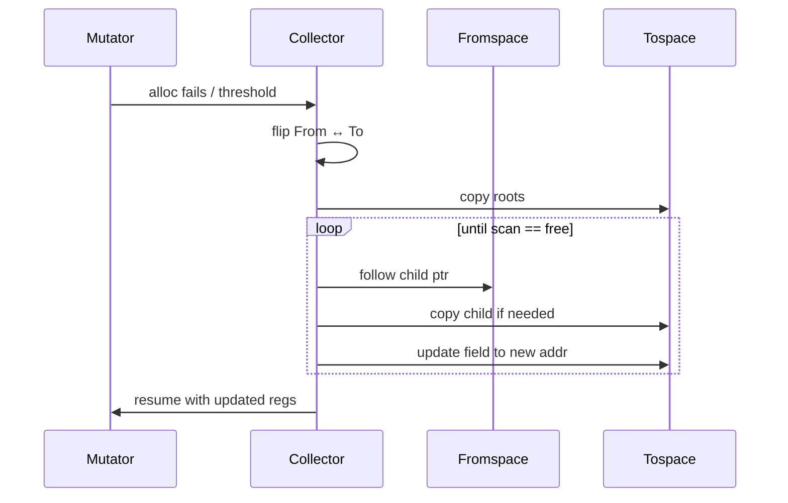

# Virtual machine and bytecode

The Glyph VM is a **register-based** bytecode interpreter with a **semi-space
copying garbage collector** (Cheney’s algorithm). Codegen emits a self-contained
**chunk**: code bytes, a constant pool, and function metadata. This document
is the ISA and runtime design note for `glyph_codegen` + `glyph_vm`.

## Chunk layout

```text
Chunk
├── code : opcode stream (ints / tagged immediates)
├── consts : literal pool (int, float, string, …)
├── functions : { name, arity, nlocals, entry_pc }*
└── entry : main function index / pc
```

On disk (`.gbc`), the driver serializes the same pieces for `glyph disasm` /
`glyph run` without recompiling.

## Frame layout

Each call pushes a **frame**:

```text
┌─────────────────────────────────────────────┐
│ Frame                                       │
│  return_pc     , IP to resume in caller     │
│  func_id       , which function metadata    │
│  regs[0‥N)     , locals / virtual registers │
│  closure_env   , captured values (or null)  │
│  caller_frame  , previous frame link        │
└─────────────────────────────────────────────┘
```



- Arguments are placed in `regs[0..arity)`.
- Extra regs hold SSA temps after allocation / spill.
- IP (instruction pointer) is either in the frame or in the interpreter loop
  alongside the current frame pointer.

Calling convention:

1. Caller evaluates args into temps.
2. `CALL` / `CALL_CLO` pushes a frame, copies args into the new frame’s regs,
   sets IP to callee entry.
3. `RET v` copies the result into the caller’s destination reg (encoded in the
   call protocol), pops the frame, restores IP.

## Value representation

| Tag | Payload | Heap? |
|-----|---------|-------|
| `Int` | integer | no |
| `Float` | float | no (or boxed if needed) |
| `Bool` | bool | no |
| `Unit` | , | no |
| `String` | bytes | yes |
| `Tuple` | field vector | yes |
| `Adt` | tag + fields | yes |
| `Closure` | fun_id + env vector | yes |
| `Native` | builtin id | no |

Immediates sit in registers; heap objects are pointers into fromspace/tospace.

## Bytecode ISA

Opcodes are illustrative of the intended ISA in `opcode.ml`. Operands are
typically register indices (`rA`, `rB`, `rC`), immediate const-pool indices
(`k`), jump offsets (`L`), field indices (`i`), or ADT tags (`t`).

### Loads, moves, constants

| Opcode | Operands | Effect |
|--------|----------|--------|
| `NOP` | , | GC safepoint / padding |
| `MOVE` | rA rB | `regs[A] ← regs[B]` |
| `LOAD_INT` | rA k | `regs[A] ← Int(consts[k])` or immediate |
| `LOAD_FLOAT` | rA k | float from pool |
| `LOAD_BOOL` | rA b | `true`/`false` |
| `LOAD_STRING` | rA k | string from pool |
| `LOAD_UNIT` | rA | `()` |
| `LOAD_GLOBAL` | rA g | global slot |
| `STORE_GLOBAL` | g rA | write global |

### Arithmetic and comparisons

| Opcode | Operands | Effect |
|--------|----------|--------|
| `ADD` `SUB` `MUL` `DIV` `MOD` | rA rB rC | `A ← B ⊕ C` (Int) |
| `FADD` `FSUB` `FMUL` `FDIV` | rA rB rC | Float ops |
| `NEG` | rA rB | `A ← -B` |
| `NOT` | rA rB | boolean not |
| `EQ` `NE` `LT` `LE` `GT` `GE` | rA rB rC | `A ← Bool(B ⋈ C)` |

### Control flow

| Opcode | Operands | Effect |
|--------|----------|--------|
| `JMP` | L | unconditional jump |
| `JMP_IF` | rA L | jump if `regs[A]` true |
| `JMP_IF_NOT` | rA L | jump if false |
| `SWITCH_TAG` | rA table… | jump by ADT tag (or dense jump table) |
| `HALT` | , | stop interpreter |

### Calls and returns

| Opcode | Operands | Effect |
|--------|----------|--------|
| `CALL` | rDest f rArgs… | call known function |
| `CALL_CLO` | rDest rClo rArgs… | call closure |
| `CALL_NATIVE` | rDest n rArgs… | builtin |
| `RET` | rA | return value |

### Heap allocation and access

| Opcode | Operands | Effect |
|--------|----------|--------|
| `ALLOC_TUPLE` | rA n rFields… | allocate tuple |
| `ALLOC_ADT` | rA tag n rFields… | allocate constructor cell |
| `ALLOC_CLOSURE` | rA f n rCaps… | allocate closure |
| `GET_FIELD` | rA rB i | `A ← B.fields[i]` |
| `GET_TAG` | rA rB | `A ← Int(tag of ADT B)` |
| `IS_TAG` | rA rB t | `A ← Bool(tag(B)==t)` |

### I/O builtins (optional dedicated opcodes)

| Opcode | Operands | Effect |
|--------|----------|--------|
| `PRINT_INT` | rA | print integer |
| `PRINT_STRING` | rA | print string |
| `PRINT_BOOL` | rA | print bool |

Dedicated print opcodes are sugar over `CALL_NATIVE`; either style is fine as
long as disasm stays readable.

## Interpreter loop

```text
loop:
  op <- code[ip++]
  match op with
  | ADD a b c -> regs[a] <- add regs[b] regs[c]
  | JMP L     -> ip <- L
  | CALL …    -> push frame; ip <- entry
  | RET a     -> pop frame; deliver regs[a]
  | ALLOC_*   -> maybe_gc(); regs[a] <- heap_alloc …
  | HALT      -> return
```

Allocation checks `heap.need_gc` (or free pointer bump) and triggers
collection before the object is created.

## Semi-space copying GC (Cheney)

### Idea

Split the heap into two equal **semispaces**: **fromspace** (live objects live
here) and **tospace** (empty, allocation target after flip). On collection:

1. Flip roles of the two spaces.
2. Copy roots into tospace, installing **forwarding pointers** in old objects.
3. Scan tospace breadth-first; copy children; update pointers.
4. Discard fromspace contents (bump allocator reset).

No fragmentation; live data is compacted. Cost proportional to **live** data,
not the whole heap.

### Layout



After flip + copy:



### Walkthrough

**Roots:** all registers in every frame, global slots, and the value currently
being assembled for a call, anything the mutator can reach.

**Copy an object `p`:**

```text
copy(p):
  if p is immediate: return p
  if p.forwarded: return forwarding pointer
  q <- bump-allocate size(p) in tospace
  memcpy fields p → q
  p.forward := q          (* forwarding pointer in old header *)
  return q
```

**Cheney scan:**

```text
flip spaces
scan <- tospace.base
free <- tospace.base
for each root r:
  r <- copy(r)
while scan < free:
  for each pointer field f in object_at(scan):
    *f <- copy(*f)
  scan <- scan + size(object_at(scan))
```



### Example

Before GC, fromspace holds a `Cons` cell and a closure; a dead tuple sits
between them. Registers point at `Cons` and the closure.

1. Flip.
2. Copy `Cons` → tospace `@T0`; leave forward at old address.
3. Copy closure → `@T1`.
4. Scan `@T0`: field `head` is an int (unchanged); field `tail` is `Nil`
   immediate or another pointer, copy if heap.
5. Scan `@T1`: update captured env pointers the same way.
6. Dead tuple is never copied, reclaimed implicitly.

### Safepoints

`NOP` (or explicit `GC_CHECK`) at call sites / loop backs lets the compiler
ensure all live pointers are in roots (no pointers only in physical machine
regs outside the frame, easy in a pure interpreter).

### Tradeoffs

| Pros | Cons |
|------|------|
| Simple, compacting | 2× heap reserved |
| No write barrier | Pause ∝ live set |
| Great teaching GC | Not generational |

Enough for Glyph’s workload; can graduate to generational later without
changing the ISA much.

## Disassembly

`glyph disasm foo.gbc` prints something like:

```text
fun main arity=0 locals=4 entry=0
0000  LOAD_INT   r0 20
0001  CALL       r1 fib r0
0002  PRINT_INT  r1
0003  LOAD_UNIT  r2
0004  RET        r2
```

## Related

- [ir.md](ir.md), how φ become moves before emit
- [optimizations.md](optimizations.md), fewer ops reach the VM
- [contributing.md](contributing.md), running examples under the VM
