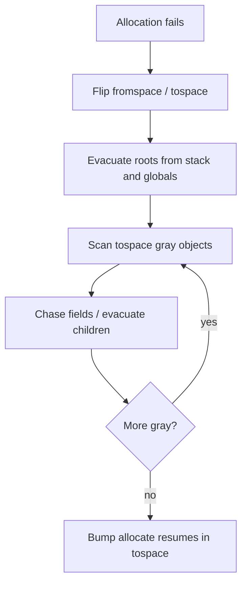

# Virtual machine

The Glyph VM executes register-based bytecode produced by the compiler
backend. It is intentionally small and inspectable: every opcode fits in a
single tagged instruction word plus immediate operands, and the heap layout
is explicit.

## Instruction set (summary)

| Class | Examples | Role |
|-------|----------|------|
| Move / const | `Move`, `LoadConst` | Values into registers |
| Arithmetic | `AddI`, `SubI`, `MulF`, … | Int/float ops |
| Compare | `Eq`, `Lt`, … | Produce booleans |
| Control | `Jump`, `JumpIf`, `Switch`, `Ret` | CFG |
| Calls | `Call`, `TailCall`, `CallClosure` | Functions / closures |
| Heap | `Alloc`, `GetField`, `SetField`, `MakeClosure` | Objects |
| Effects | `Print`, `Halt` | Builtins / stop |

See `lib/codegen/opcode.ml` for the authoritative enumeration and encodings.

## Chunks

A `Chunk.t` holds:

- code: dense instruction array
- constants: int / float / string / function-proto indices
- prototypes: arity, register count, entry IP
- optional line table for diagnostics

`.gbc` files are a simple binary serialization of chunks so `glyph compile`
and `glyph run` share one format.

## Frames

Each call pushes a frame:

```
regs[0 .. nregs)
ip
closure (optional)
caller frame link
```

Arguments land in the low registers; the callee returns a value in a
designated register that the caller copies into its destination.

## Heap objects

| Tag | Payload |
|-----|---------|
| String | bytes |
| Tuple | N fields |
| Adt | constructor tag + fields |
| Closure | proto index + captured values |
| Array | length + elements |
| Forward | forwarding pointer (GC only) |

## Garbage collector

Semi-space copying collection (Cheney):



During a collection, every live object is copied once into tospace and leaves
a forwarding pointer behind. Mutual references are fine because evacuation is
idempotent: a second visit sees the forward and rewrites the field.

## Builtins

Builtins are opcode-adjacent traps or dedicated opcodes (`Print`) that read
registers and write results without leaving the interpreter loop. Higher-level
prelude functions are ordinary Glyph code that calls these traps.
